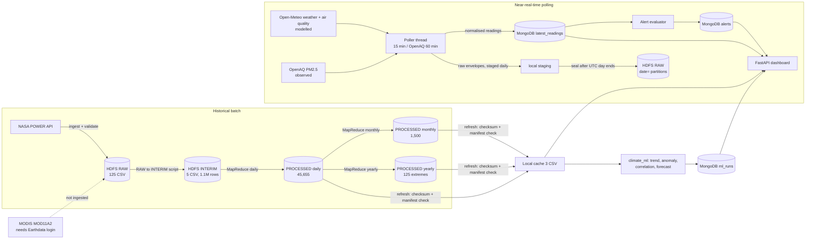
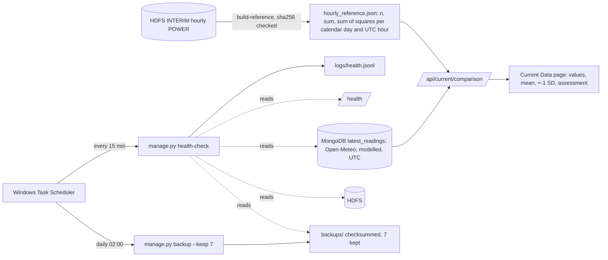

# EarthScape system architecture

Single-machine academic system (Windows 11 + WSL2 Ubuntu for Hadoop). No microservices, containers, queues or streaming platform. Provider facts: [datasets.md](datasets.md). HDFS layout and ingestion design in detail: [data-architecture.md](data-architecture.md).

## Components
| Component | Technology | Role |
|---|---|---|
| Web app | FastAPI + Jinja2, Bootstrap, Chart.js, uvicorn on 127.0.0.1:8000 | dashboards, JSON APIs, authentication, administration |
| Application database | MongoDB (local, database `earthscape`) | users, sessions, feedback, alert rules and alerts, current readings, ingest status, ML runs. **Not** the historical dataset |
| Big-data storage | Hadoop 3.4.3 HDFS (WSL, `/earthscape`) | RAW, INTERIM, PROCESSED layers and manifests |
| Batch processing | Hadoop MapReduce (Streaming, Python) on YARN | hourly to daily, monthly and yearly aggregation |
| Analytics | pandas, scikit-learn, SciPy | trends, anomalies, correlation, forecasts |
| Collection | Python standard library (`urllib`) polling thread | Open-Meteo weather and air quality, OpenAQ |
| Historical reference | `src/app/reference.py`, `manage.py build-reference` | hour-of-day climatology (2001-2025, +-7 days) from verified INTERIM; used by `/api/current/comparison` |
| Monitoring and backup | `src/app/monitor.py`, `manage.py health-check` / `backup`, Windows Task Scheduler | 15-min health check to `logs/health.jsonl`; daily backup with retention |
| Notebooks | Jupyter, kernel `EarthScape` | exploratory analysis |

## Data flow

The app never reads HDFS per request: `refresh-data` copies the three PROCESSED files (about 4.4 MB) into `data/processed/app_cache/` after verifying size, sha256, header, row count and daily-to-monthly lineage against the provenance manifests; it keeps the previous cache on any failure.

## Data classes (never mixed)
POWER = gridded reanalysis + satellite radiation (derived aggregates). Open-Meteo weather and air quality = **modelled**. OpenAQ = **observed** by third-party monitors (reference and low-cost). ML output = **predicted/model-derived**. Every page and API says which.

## HDFS layout (`/earthscape`)
```
_manifest/<source>.jsonl         append-only provenance (last line per object_key wins)
raw/power_hourly_gridded/city=<c>/year=<y>/*.csv                       125 objects
raw/openmeteo_weather_model/date=YYYY-MM-DD/polls.jsonl                sealed daily (envelopes of raw responses)
raw/openmeteo_airquality_model/date=YYYY-MM-DD/polls.jsonl
raw/openaq_observed/current/date=YYYY-MM-DD/latest.jsonl
raw/modis_mod11a2_satellite/tile=<t>/year=<y>/<native>.hdf             not created (no credentials)
interim/power_hourly/city=<c>/power_hourly_<c>.csv                     5 objects
processed/power_daily | power_monthly | power_yearly /part-00000
```
RAW is immutable (never overwritten; an identical object is adopted, a different one refused). Layers, partitioning, idempotency and failure handling: data-architecture.md.

## Ingestion pipeline (current sources)
`fetch (bounded retries, 429/5xx backoff) -> raw envelope appended to data/staging/<source>/date=... -> normalise (UTC timestamps, units, provider metadata, value_origin) -> upsert into latest_readings (unique source/city/station/observed_at; 30-day TTL) -> ingest_status updated -> alerts evaluated -> after the UTC day ends, seal_raw uploads the staged file to HDFS (size+sha256 read-back, mv, manifest line)`. OpenAQ: per city, locations within 25 km that reported in the last 7 days, newest values per location, PM2.5 sensors only, throttled to the 60 requests/minute limit. This is **near-real-time REST polling, not continuous event streaming**.

## MapReduce processing
Three Hadoop Streaming jobs (Python mapper/reducer, `-D mapreduce.job.reduces=1`, exact Decimal arithmetic, deterministic output), submitted to YARN by [run_power_job.py](../src/processing/mapreduce/run_power_job.py), which verifies inputs by manifest, checks YARN `Final-State`, verifies the output with an independent Fraction-based recomputation from INTERIM, publishes without overwriting, and writes provenance. Results and schemas: data-architecture.md "MapReduce results".
| Job | Input | Output | Rows | YARN application |
|---|---|---|---|---|
| daily | 5 INTERIM files | `processed/power_daily` | 45,655 | application_1791451740685_0004 |
| monthly | daily | `processed/power_monthly` | 1,500 | application_1791451740685_0005 |
| yearly | daily | `processed/power_yearly` | 125 | application_1791451740685_0006 |

The yearly job (annual means and ETCCDI-style extreme-event counts) is the one additional job justified by the extremes/patterns requirement. POWER INTERIM is 67 MB, below one HDFS block, so MapReduce here demonstrates the architecture; it does not claim big-data scale.

## MongoDB schema (database `earthscape`)
| Collection | Key fields | Indexes |
|---|---|---|
| users | username (lowercase), password_hash (Argon2id), role, active, failed_logins, locked_until, last_login | unique `username` |
| sessions | _id = sha256(token), user_id (null = pre-login), csrf, expires_at, flash | TTL `expires_at`; `user_id` |
| feedback | user_id, username, category, subject, message, status, created_at | `created_at`; `status` |
| alert_rules | name, city_id (or `all`), variable, operator, threshold, severity, enabled, created_by | unique `name`; `enabled+variable` |
| alerts | rule_id, city_id, station_key, variable, value, last_value, unit, source, value_origin, observed_at, evaluated_at, status (open/acknowledged/cleared), acknowledged_by | unique `rule_id+city_id+station_key+observed_at`; `status+evaluated_at` |
| latest_readings | source, value_origin, city_id, station_key, observed_at, retrieved_at, values{}, units{}, provider{} | unique `source+city_id+station_key+observed_at`; `city_id+source+observed_at`; TTL 30 d on `retrieved_at` |
| ingest_status | _id = source (or `alert_evaluation`), last_attempt, last_success, last_errors, consecutive_failures | primary key |
| ml_runs | model_version, created_at, seed, trend, anomalies, correlation, forecast, artifact_dir | `created_at` |

## Authentication and RBAC
Login form -> `authenticate` (Argon2id verify; a dummy hash is verified for unknown users so timing is similar; five failures lock the account 15 minutes) -> new random token set in an HttpOnly, SameSite=Lax cookie; MongoDB stores only its SHA-256 with a TTL. Every POST carries a per-session CSRF token. `need_user` guards all pages and APIs (401 JSON for `/api`, redirect for pages); `need_admin` guards user management, feedback review, data refresh, manual polling and retraining (403 otherwise). Disabling a user, changing a role or resetting a password deletes their sessions. The last active Administrator cannot be demoted or disabled.

| Capability | Administrator | Analyst |
|---|---|---|
| Dashboards, current data, trends, forecasts, alert history, acknowledge alerts | yes | yes |
| Create/edit/disable alert rules, submit feedback | yes | yes |
| User management, feedback review, data refresh, poll now, retrain | yes | no |

## Alert workflow
1. A user creates a rule (city or all, variable with its source and unit, operator, threshold, severity).
2. After every poll `evaluate_alerts` takes, per rule and city (OpenAQ: per monitoring location), the newest reading. **Stale readings** (weather &gt; 60 min, air quality &gt; 3 h, OpenAQ &gt; 24 h) are skipped and counted; they never raise or clear alerts.
3. Condition true and no open/acknowledged episode: one alert is created (value, unit, source, modelled/observed, measurement and evaluation times). While the condition keeps holding, the existing alert is updated, not duplicated.
4. Condition false: the episode is marked `cleared`; a later breach creates a new alert.
5. Users see alerts in Alert History and the navigation badge and acknowledge them. **No email or SMS is configured.** Rules on historical POWER variables are stored but never evaluated.

## Software roles (resolved)
MongoDB: mandatory application database (implemented). Hadoop/HDFS/YARN/MapReduce: mandatory batch platform (implemented). Jupyter: analysis tool (executed notebook). Apache HTTP Server: deployment aid (reverse proxy/TLS), documented, not installed. Impala, Tableau, R/RStudio: not integrated; without the SRS their status (mandatory vs optional) is unknown and they are listed as not implemented in [srs-completion-plan.md](srs-completion-plan.md).

## Current vs historical comparison and monitoring (final phase)

Only temperature (C) and relative humidity (%) are compared; both sides are UTC; readings with another unit, stale readings (> 60 min) and hours with fewer than 200 historical samples are reported as such rather than compared.
